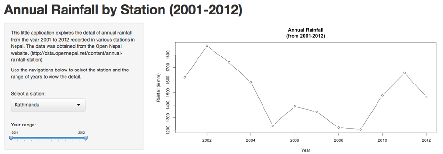

## Introduction

This shiny application uses a data on annual rainfall in various parts of Nepal. The data was collected from 43 stations during the year 2001 to 2012. Rainfall is measured in millimeters.

In order to make an application simpler, data from only 6 major cities are considered.

The data is available from OpenNepal website (http://data.opennepal.net/content/annual-rainfall-station).

--- .class #id 

## About the data
The summarize view of data is as below;

```r
raindata <- read.csv("annual_rainfall_by_station.csv")
summary(raindata)
```

```
##                    Station         Year      Rainfall..mm.
##  Banke, Nepalganj      : 12   Min.   :2001   NA     : 24  
##  Bara, Nijghad         : 12   1st Qu.:2003   -      :  7  
##  Bara, Simara  Airport : 12   Median :2006   1669   :  4  
##  Bhaktapur, Nagarkot   : 12   Mean   :2006   -      :  2  
##  Chitawan, Rampur      : 12   3rd Qu.:2009   1086   :  2  
##  Dadeldhura,Dadeldhura : 12   Max.   :2012   (Other):452  
##  (Other)               :442                  NA's   : 23
```

---

## Basic Exploratory Analysis


```r
plot(raindata$Year, raindata$Rainfall..mm., xlab="Year", ylab="Rainfall(mm)")
```

 

---

## The application
The application provides interface to select a station and a range for year.


